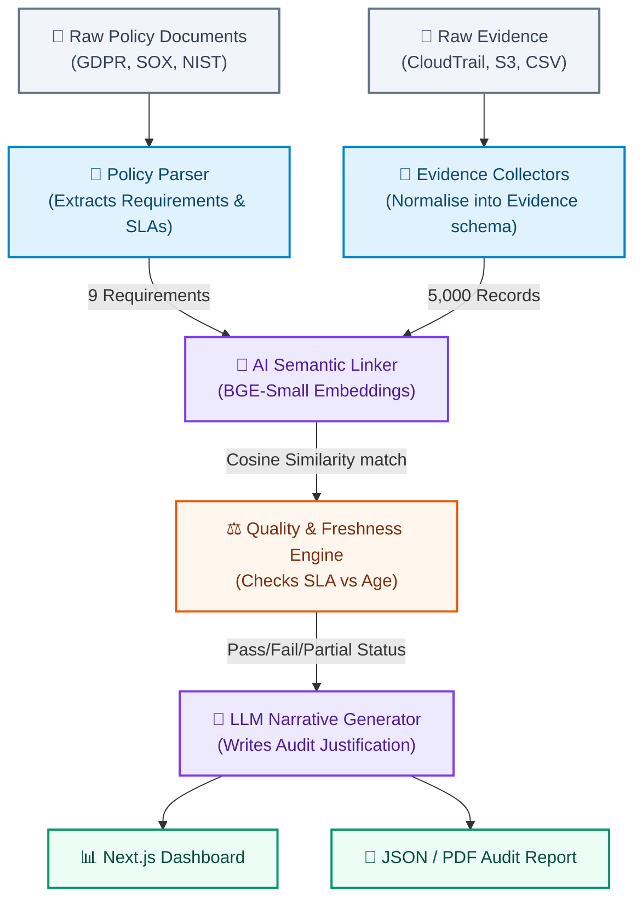
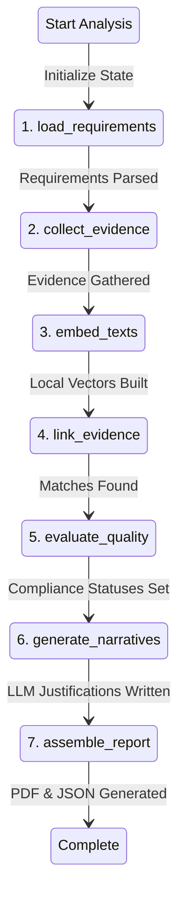

# CompAud: 5-Minute Video Demo Script & Architecture

## Architecture Diagrams

Here are the two mermaid charts representing the data flow and workflow orchestration of CompAud.

### 1. High-Level Data Flow Architecture
This chart shows how raw evidence and policies move through the system to become an auditor-ready report.

### 2. The LangGraph Pipeline Workflow
This chart shows the exact step-by-step state machine executing in the Python backend.

---

## 5-Minute Video Demo Script

### 0:00 - 0:40 | The Pain & The Opportunity
**[Action: Present Slide 1 (CompAud Title Slide)]**
*   "Hey everyone, we're Team Mechatrons. Let's talk about compliance audits.
*   If you've ever worked in IT or engineering, you know the drill: an auditor asks, 'Can you prove your encryption and access controls are actually working?' and suddenly your team is stuck in spreadsheet hell for weeks—manually chasing logs, taking database screenshots, and hunting for ticket approvals."

**[Action: Switch to Slide 2 (Every Audit Starts with Spreadsheet Work)]**
*   "This manual chasing leads to stale proof, missing links, and a process that just doesn't scale. We built **CompAud** to fix this. It takes a stack of policy documents and a mountain of raw data, and turns it into a clear, auditor-ready report in under 30 seconds."

---

### 0:40 - 1:40 | Smart Matching: Bypassing the Noise
**[Action: Switch to Slide 3 (One Pipeline, Five Stages)]**
*   "Our system handles this through a simple, robust pipeline: we **Parse** policies to find the rules, automatically **Collect** evidence from systems, **Link** them together, **Evaluate** how fresh the data is, and compile an auditor-friendly **Report**."

**[Action: Switch to Slide 4 (We Audited the Data — and Refused to Trust It)]**
*   "When we looked at the dataset, we found that naive database joins would fail. The IDs were fake, the labels were extremely noisy, and the summary texts were identical templates. Instead of trying to force standard database lookups or matching on noisy labels, we built a smart matching engine. We used a local text-matching model to link evidence based on actual meaning, and calculated compliance statuses mathematically using real fields like timestamps and approval status."

---

### 1:40 - 2:30 | How the Logic Works
**[Action: Switch to Slide 5 (Policy Frequency -> Freshness SLA)]**
*   "To make this auditable, we translate policy review frequencies into strict deadlines. For example, a continuous control requires evidence from the last 24 hours. A quarterly control allows up to 90 days.
*   This slide shows a worked example: a stale manual record is automatically offset by a fresh, automated CloudTrail log, instantly proving compliance for our data in transit requirement."

**[Action: Switch to Slide 6 (Deterministic Pipeline)]**
*   "Under the hood, everything is orchestrated step-by-step. We run a lightweight text-matching model locally, meaning no expensive external API calls or latency.
*   Most importantly: **the AI never decides your compliance status**. Status calculation is 100% rule-based and reproducible. We only use generative AI at the very end to write clear, human-readable explanations for the auditor."

---

### 2:30 - 3:30 | Live Demo: Putting it to the Test
**[Action: Switch window to the Live Next.js Dashboard on the home screen]**
*   "Let's see it in action. I'm on the dashboard, and I'll click **'Run compliance analysis'**."

**[Action: Point cursor to the step-by-step progress bar as it updates]**
*   "Right now, the backend is running through the steps in real-time: reading the policies, collecting the logs, linking the evidence, checking deadlines, and writing explanations.
*   It processed over 5,000 logs against our policy requirements in about 23 seconds. Almost all of that time was just embedding the text—the actual linking and validation takes less than a second."

---

### 3:30 - 4:25 | Reading the Dashboard
**[Action: Hover over the top metric cards (56%, 89%, 100%, 508 evidence items)]**
*   "Here is our completed dashboard. We have an overall compliance score of 56% across 9 requirements, with 89% evidence coverage. 
*   We can easily filter the view by framework—like GDPR, NIST, or SOX—to see exactly where we stand.
*   Let's click on `POL-ENC-001-R2` (Encryption keys must be rotated at least annually).
*   On the right, we see the status is **COMPLIANT**.
*   "At the bottom, we see the exact evidence backing this up. The key metrics are **Collected** (the collection date), **Old** (its age in days), **Conf** (its reliability score), and **Link** (our similarity matching score). 
*   We categorize compliance status mathematically: **Compliant** means we have fresh, approved evidence within the policy window. **Partial** means we have evidence but it's stale or unreviewed. And a **Gap** means we have no matching logs at all."

---

### 4:25 - 5:00 | Audit-Ready PDF & Scale
**[Action: Click the 'Download PDF' button and open the PDF layout]**
*   "To make this useful for a real audit, we can download the PDF report. It includes a structured executive summary, deterministic statuses, and clean narratives citing the exact log IDs used for verification."

**[Action: Switch back to PPT, show Slide 9 (Roadmap) & Slide 10 (Takeaway)]**
*   "To scale this for millions of records, we can cache text embeddings, group searches by framework, and use standard indexing libraries like FAISS.
*   By refusing to rely on noisy or misleading labels, CompAud brings true automation and mathematical certainty to enterprise compliance. Thank you!"
